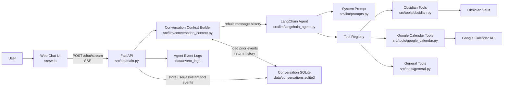
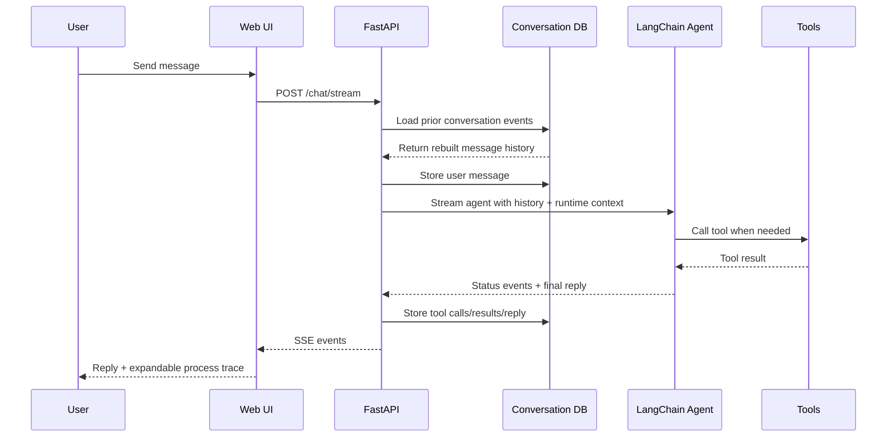
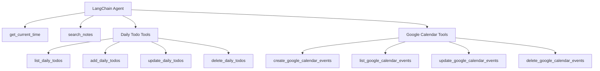
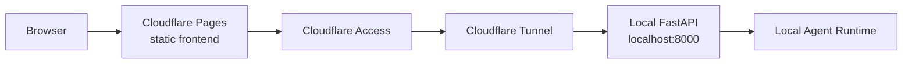

# Personal AI Assistant for Productivity

A local-first personal AI assistant built around FastAPI, LangChain/LangGraph-style tool use, an Obsidian knowledge base, local conversation memory, SSE streaming, and Google Calendar tools.

This is for my personal assistance. The project is also a learning project for AI agent fundamentals: tool calling, retrieval, memory, observability, and eventually multi-agent design. Future work includes financial trackers, telegram bot integration, advance RAG pipeline and richer personal productivity workflows.

## Current Capabilities

- Chat with a LangChain `create_agent` assistant.
- Search an Obsidian vault through local retrieval.
- Manage daily todos stored in Obsidian markdown files.
- Create, list, update, and delete Google Calendar events through OAuth.
- Store conversations, tool calls, tool results, errors, and future summaries in local SQLite.
- Rebuild conversation history from SQLite before each agent run.
- Stream agent status events to the web UI with Server-Sent Events.
- Show an expandable process trace for tool calls and tool results.
- Serve a local web UI from FastAPI.
- Future: financial tracker tools and workflows.

## Architecture



## Runtime Flow



## Tool Surface



## Google Calendar Behavior

Calendar tools are for important scheduled events, not minor daily todos.

- Date only creates an all-day event.
- Date + start time with no end time defaults to 1 hour.
- Create 1 or 2 events without confirmation.
- Create 3 or more events only after confirmation.
- Update 1 or 2 events without confirmation.
- Update 3 or more events only after confirmation.
- Delete any event only after confirmation.
- Before update/delete, the agent should list matching events and use `event_id + expected_title`.
- Raw Google Calendar event IDs are internal tool identifiers and should not be shown in final user-facing replies.

Category color mapping:

| Category | Color |
| --- | --- |
| `career` | blue |
| `learning` | purple |
| `personal` | cyan |
| `finance` | yellow |
| `health` | green |
| `travel` | red |
| `important` | orange |

## Local Setup

Install dependencies:

```powershell
uv sync
```

Run the local FastAPI app:

```powershell
uv run uvicorn src.api.main:app --reload --host 127.0.0.1 --port 8000
```

Open:

```text
http://127.0.0.1:8000
```

## Environment

Create a local `.env` file. At minimum, configure the model provider and local paths used by your setup.

Google Calendar OAuth uses:

```env
GOOGLE_OAUTH_CLIENT_SECRETS_PATH=data/google_oauth_client_secret.json
GOOGLE_CALENDAR_TOKEN_PATH=data/google_calendar_token.json
GOOGLE_CALENDAR_ID=primary
```

Run OAuth setup once:

```powershell
uv run python scripts/google_calendar_oauth.py
```

This opens a browser for Google consent and saves a local token file.

## Important Files

| Path | Purpose |
| --- | --- |
| `src/api/main.py` | FastAPI app, SSE chat endpoint, static web serving |
| `src/llm/langchain_agent.py` | Agent construction, tool registry, event streaming |
| `src/llm/prompts.py` | System prompt and tool-use policy |
| `src/llm/conversation_context.py` | Rebuilds conversation history for the agent |
| `src/db/conver_sqlite.py` | Local SQLite conversation store |
| `src/tools/obsidian.py` | Obsidian search and daily todo tools |
| `src/tools/google_calendar.py` | Google Calendar create/list/update/delete tools |
| `scripts/google_calendar_oauth.py` | Google OAuth token setup |
| `src/web/static/app.js` | Browser chat UI behavior |

## Deployment Shape

The current deployment direction is local-first:



See `DEPLOYMENT.md` for the Cloudflare Pages, Tunnel, Access, and CORS setup.
