# Kairos

A personal assistant that actually does things. You type one sentence — "just got the badminton string done, 80.99 rm" — and it checks the matching todo, records the spend under the right category, and tells you what it did.

It is a tool-using agent wired to four things you already keep: your Obsidian notes, your daily todo files, your Google Calendar, and a finance ledger it owns end to end. On top of that sits a web app with a chat surface and a finance dashboard.

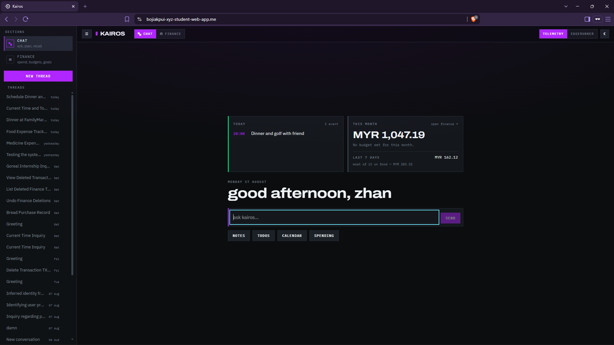

---

## What it does

**Answers from your own notes.** Your Obsidian vault is embedded into a local vector store; the agent looks up the vault's folder structure, searches the relevant scope, and answers with the note it drew from — not a guess.

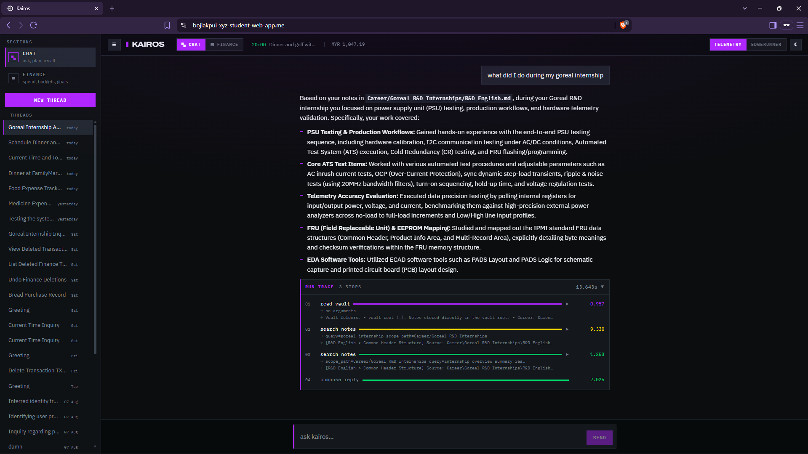

**Tracks money in plain language.** "31 for food" becomes a real transaction with a stable code like `TXN-000339`. "its under lunch" edits that same one. The agent never does arithmetic — every figure it reports comes back preformatted from the finance module, so the chat and the dashboard can never disagree.

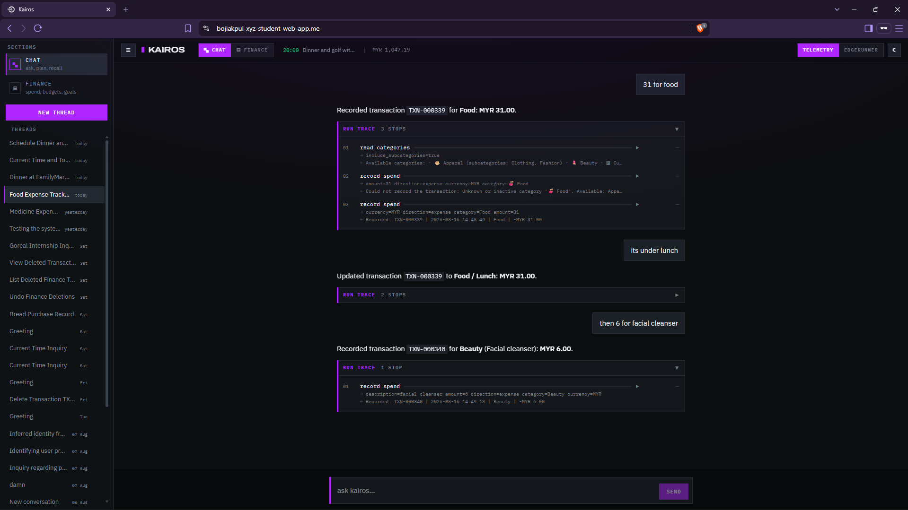

**Handles a message with more than one intent.** A sentence that reports doing something *and* names an amount is two actions, and it does both.

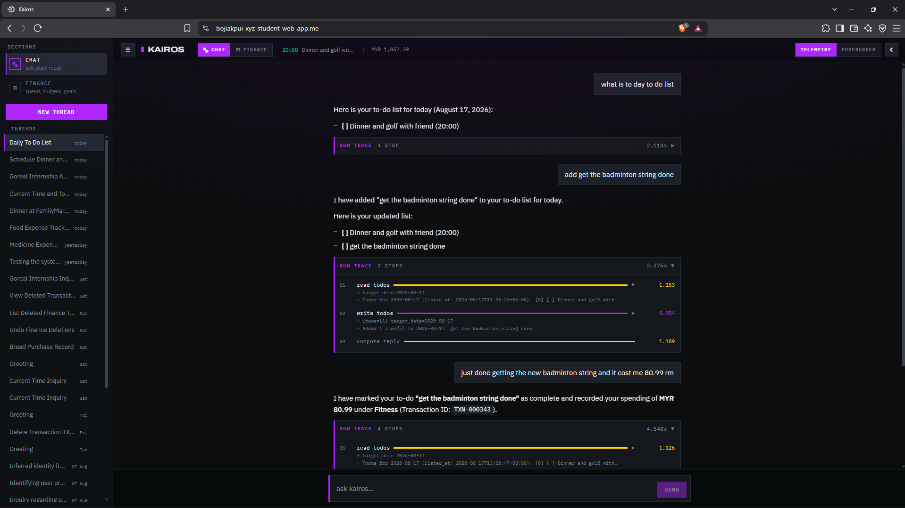

**Shows its work.** Every reply carries a run trace: which tools were called, the arguments they got, what came back, and how long each step took. When the agent picks a wrong category and retries, you see the retry.

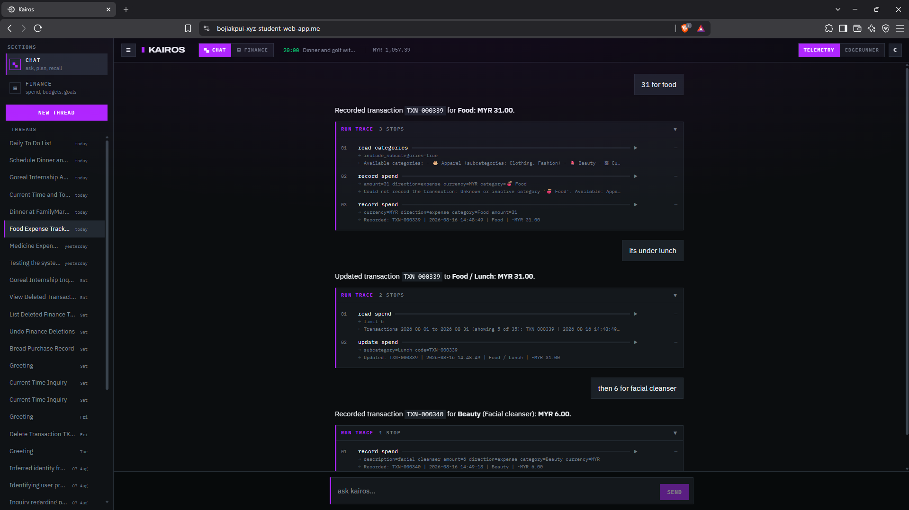

**Manages your calendar and daily todos**, with confirmation rules that scale to the risk — creating one event is free, deleting anything asks first.

All 26 tools behind these behaviours are catalogued in **[TOOLS.md](TOOLS.md)**.

---

## The finance dashboard

`/finance` is the direct-manipulation half. Month totals with a comparison to last month, a daily spend bar chart, categories ranked with the gap to the biggest, budgets, a monthly goal, and the full transaction list.

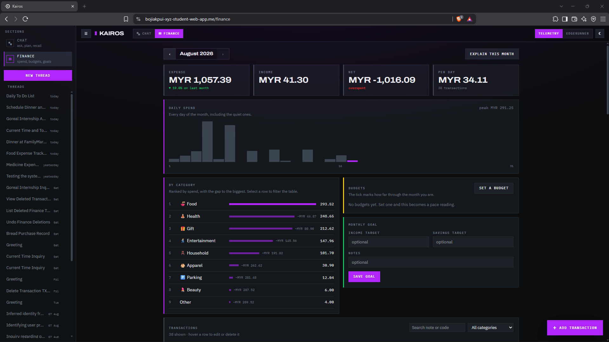

Transactions group by day with a per-day subtotal. Hover a row to edit or delete it. **Explain this month** hands the already-computed summary to a model that writes prose around it — it is given no tools and no database, so it can only narrate numbers that were already final.

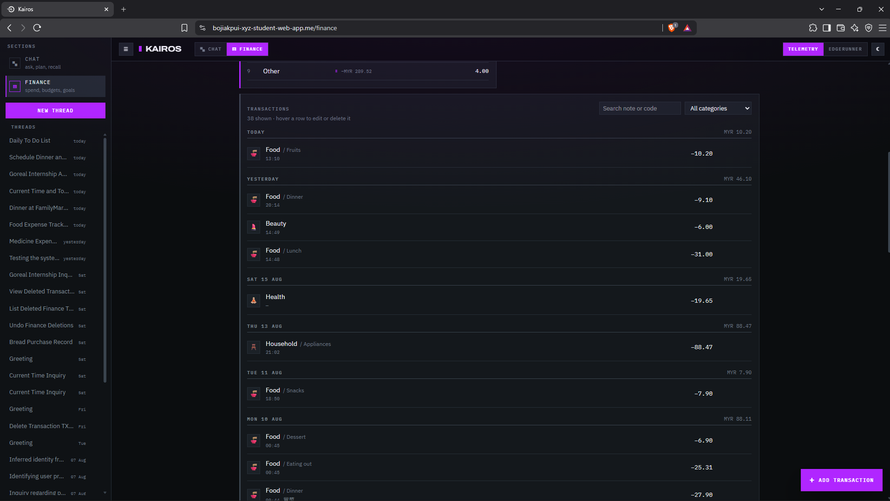

Categories are editable, and renaming one updates every past transaction so history stays together.

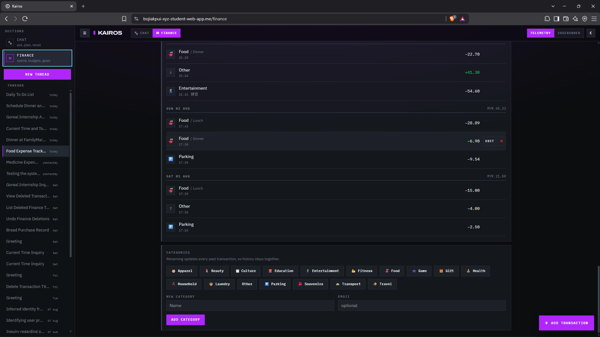

Deleting is a two-step with a way back: confirm first, then a toast with **UNDO**. Deleted transactions are soft-deleted and restorable by code.

<p align="center">
  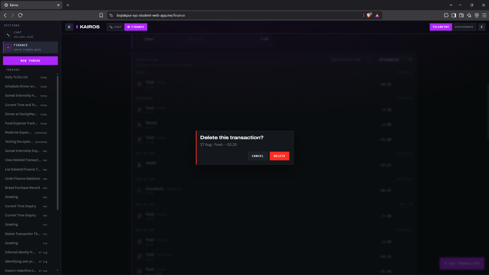
  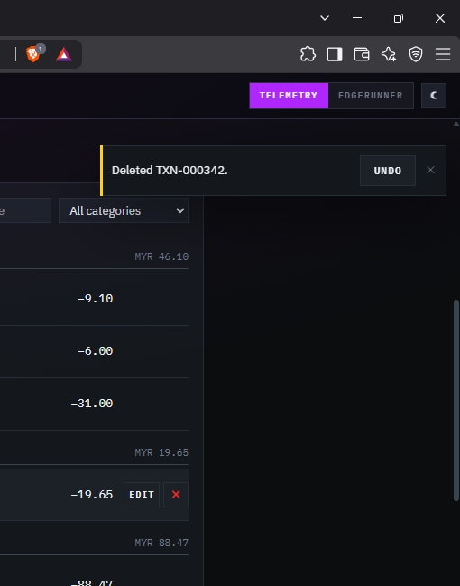
</p>

---

## Two skins

The UI ships two complete looks — **telemetry** (clean, instrument-panel) and **edgerunner** (neon, cyberpunk) — each with light and dark. They are independent axes on `<html>`, restored before first paint, and the layout does not shift between them.

<p align="center">
  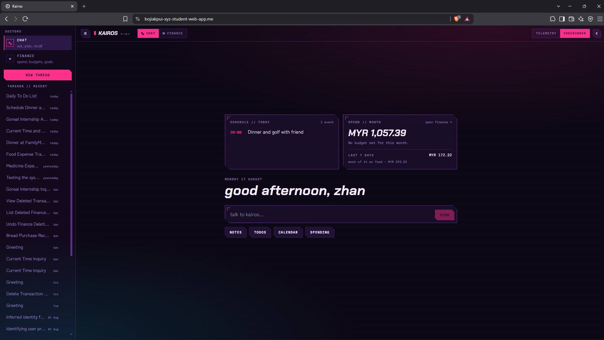
  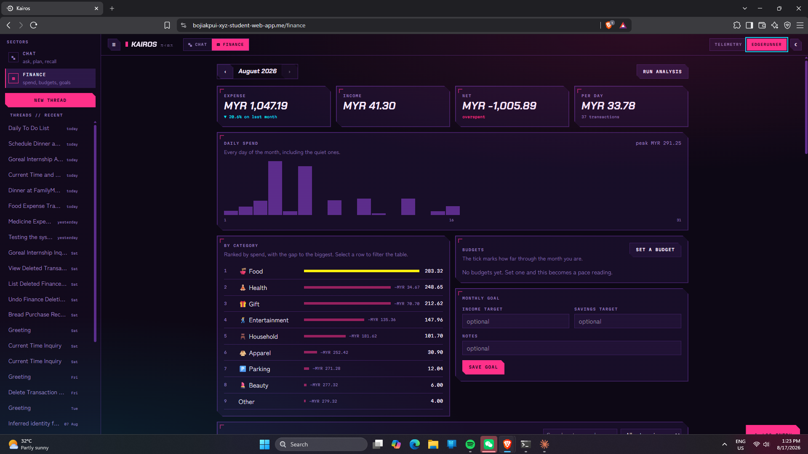
</p>

---

## How it's built

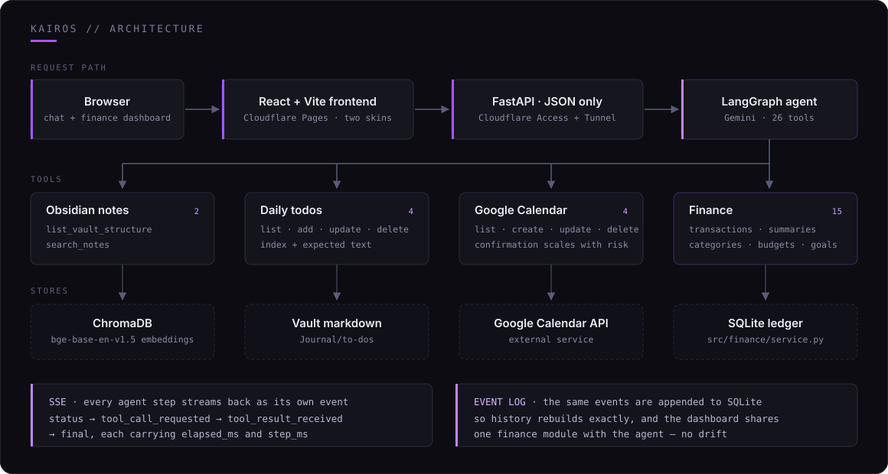

A few decisions worth knowing:

- **The frontend is fully separate.** FastAPI serves JSON and nothing else; the Vite build is deployed to Cloudflare Pages, and the API is reached over its own domain.
- **Replies stream over SSE.** Each agent step — tool requested, tool result, final answer — is its own event carrying `elapsed_ms` and `step_ms`, which is what the run trace renders.
- **Conversations are persisted** in SQLite as an event log (user messages, tool calls, tool results, assistant replies, run errors), so history rebuilds exactly. Thread titles are generated in a background thread and pushed down the same stream when ready.
- **The agent and the dashboard share one finance module.** Both call `src/finance/service.py`; no SQL or money arithmetic lives in the tool layer, so the two paths cannot drift.
- **Money is stored in minor units** with the FX rate locked onto the transaction at record time, so editing a rate policy never rewrites history. Rates come from the Frankfurter API, and there is no silent fallback — an unresolvable rate is an error, not a wrong number.
- **The agent addresses records by design code** (`TXN-000339`), never by list position.

Not everything is local. The notes, todos, ledger, and vector store live on the machine running the API; the language model (Gemini), calendar, and exchange rates are external services, and the frontend is hosted.

---

## The tools

The agent has **26 tools** across five groups. Every one of them is listed with what it
does and when the agent reaches for it in **[TOOLS.md](TOOLS.md)** — the map below is the
shape of it.

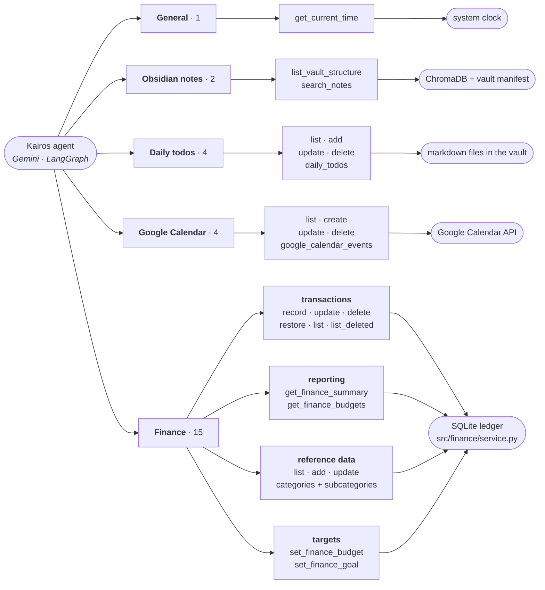
```mermaid
flowchart LR
    A(["Kairos agent<br/><i>Gemini · LangGraph</i>"])

    A --> G["<b>General</b> · 1"]
    A --> N["<b>Obsidian notes</b> · 2"]
    A --> T["<b>Daily todos</b> · 4"]
    A --> C["<b>Google Calendar</b> · 4"]
    A --> F["<b>Finance</b> · 15"]

    G --> G1["get_current_time"]
    N --> N1["list_vault_structure<br/>search_notes"]
    T --> T1["list · add<br/>update · delete<br/>daily_todos"]
    C --> C1["list · create<br/>update · delete<br/>google_calendar_events"]
    F --> F1["<b>transactions</b><br/>record · update · delete<br/>restore · list · list_deleted"]
    F --> F2["<b>reporting</b><br/>get_finance_summary<br/>get_finance_budgets"]
    F --> F3["<b>reference data</b><br/>list · add · update<br/>categories + subcategories"]
    F --> F4["<b>targets</b><br/>set_finance_budget<br/>set_finance_goal"]

    G1 --> GS(["system clock"])
    N1 --> NS(["ChromaDB + vault manifest"])
    T1 --> TS(["markdown files in the vault"])
    C1 --> CS(["Google Calendar API"])
    F1 --> FS(["SQLite ledger<br/>src/finance/service.py"])
    F2 --> FS
    F3 --> FS
    F4 --> FS
```

Two rules cut across all of them. **Read before write:** mutating tools must quote back
something from a fresh read — a todo's index and expected text, a calendar `event_id` and
title, a transaction's design code — and a stale reference is refused rather than applied
to the wrong row. **The model never computes money:** finance tools hand back
preformatted strings, so there is no raw number for it to add up.

---

## How a message becomes an answer

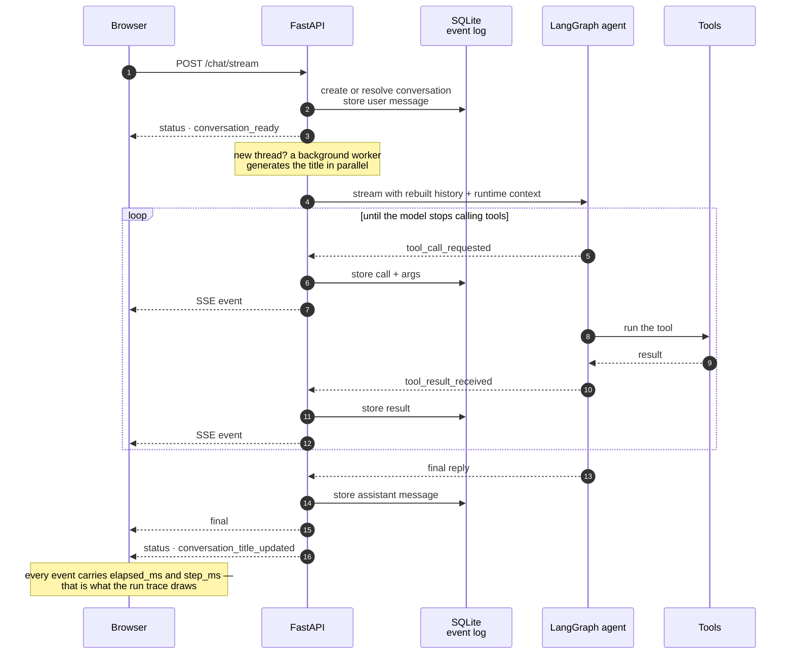
```mermaid
sequenceDiagram
    autonumber
    participant B as Browser
    participant API as FastAPI
    participant DB as SQLite<br/>event log
    participant AG as LangGraph agent
    participant TL as Tools

    B->>API: POST /chat/stream
    API->>DB: create or resolve conversation<br/>store user message
    API-->>B: status · conversation_ready
    Note over API: new thread? a background worker<br/>generates the title in parallel

    API->>AG: stream with rebuilt history + runtime context

    loop until the model stops calling tools
        AG-->>API: tool_call_requested
        API->>DB: store call + args
        API-->>B: SSE event
        AG->>TL: run the tool
        TL-->>AG: result
        AG-->>API: tool_result_received
        API->>DB: store result
        API-->>B: SSE event
    end

    AG-->>API: final reply
    API->>DB: store assistant message
    API-->>B: final
    API-->>B: status · conversation_title_updated
    Note over B: every event carries elapsed_ms and step_ms —<br/>that is what the run trace draws
```

If a run ends without a reply, the error is written to the log rather than swallowed, and
the thread shows what happened.

---

## Keeping the vault in sync

Notes are only useful to the agent once they are embedded, and re-embedding a whole vault
on every keystroke is wasteful. So a watcher sits on the vault, waits for you to stop
typing, and then syncs only what actually changed.

`scripts/watch_vault.ps1` runs a `FileSystemWatcher` over the vault, ignores everything
that is not a note or an image, and debounces on a **five-minute quiet period** — the
timer restarts on every change, so a long editing session triggers exactly one sync at the
end of it. That sync runs `scripts/ingest_vault.py`, which is incremental: each note is
hashed together with the bytes of every image it references, so swapping a screenshot
without touching a word still counts as a change, while an untouched note is skipped
entirely.

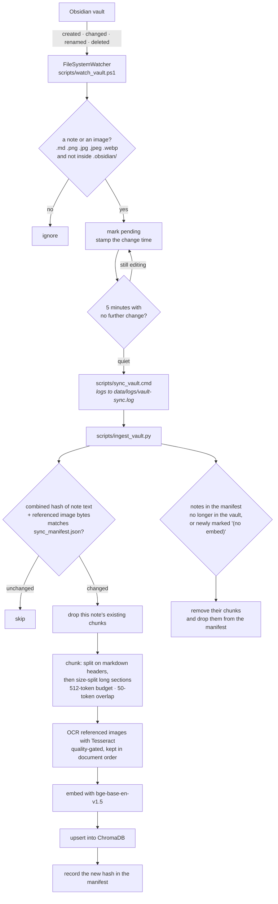
```mermaid
flowchart TD
    V["Obsidian vault"] -->|"created · changed · renamed · deleted"| W["FileSystemWatcher<br/>scripts/watch_vault.ps1"]
    W --> REL{"a note or an image?<br/>.md .png .jpg .jpeg .webp<br/>and not inside .obsidian/"}
    REL -->|no| IG["ignore"]
    REL -->|yes| P["mark pending<br/>stamp the change time"]
    P --> Q{"5 minutes with<br/>no further change?"}
    Q -->|"still editing"| P
    Q -->|"quiet"| S["scripts/sync_vault.cmd<br/><i>logs to data/logs/vault-sync.log</i>"]
    S --> I["scripts/ingest_vault.py"]

    I --> H{"combined hash of note text<br/>+ referenced image bytes<br/>matches sync_manifest.json?"}
    H -->|"unchanged"| SK["skip"]
    H -->|"changed"| D["drop this note's existing chunks"]
    D --> CH["chunk: split on markdown headers,<br/>then size-split long sections<br/>512-token budget · 50-token overlap"]
    CH --> OC["OCR referenced images with Tesseract<br/>quality-gated, kept in document order"]
    OC --> EM["embed with bge-base-en-v1.5"]
    EM --> UP["upsert into ChromaDB"]
    UP --> MF["record the new hash in the manifest"]

    I --> GONE{"notes in the manifest<br/>no longer in the vault,<br/>or newly marked '(no embed)'"}
    GONE --> RM["remove their chunks<br/>and drop them from the manifest"]
```

Details worth knowing: chunk size is measured with the embedder's own tokenizer against
the fully assembled string that gets embedded, not a word-count guess. Every chunk carries
a folder and title prefix for better fuzzy recall, plus `chunk_index` / `total_chunks` so
neighbouring context can be pulled without re-reading the whole note. OCR text becomes its
own chunk sitting in its true position in the document, not appended at the end. And a note
whose filename ends in `(no embed)` is excluded — adding that marker to an already-ingested
note removes its chunks on the next sync.

Start the watcher with:

```bash
powershell -ExecutionPolicy Bypass -File scripts/watch_vault.ps1
```

Or skip it and run a sync by hand whenever you like — `uv run python -m scripts.ingest_vault`
does the same work.

---

## Repo layout

```text
src/
  api/         FastAPI app — chat SSE, conversations, finance, calendar routes
  llm/         agent construction, prompts, conversation context, report narration
  tools/       LangChain tools: obsidian, todos, google_calendar, finance, general
  finance/     service, summary, money, fx, codes, importer — the finance core
  retrieval/   vault search + folder manifest
  db/          SQLite schemas (conversations, finance) and the Chroma vault store
  logging/     agent event log
web/           React + Vite frontend (chat page, finance page, skins)
scripts/       vault ingestion, the file watcher, and Google OAuth helpers
tests/         pytest suite over the finance module, tools, and API
TOOLS.md       every agent tool, what it does, and when it is used
```

---

## Running it

Requires Python 3.12+, [uv](https://docs.astral.sh/uv/), Node 20+, and Tesseract if you want OCR of images inside notes.

Set up the environment (`.env`):

```text
VAULT_PATH=                            # your Obsidian vault
GOOGLE_API_KEY=                        # Gemini
GOOGLE_OAUTH_CLIENT_SECRETS_PATH=      # Google Calendar OAuth client
GOOGLE_CALENDAR_TOKEN_PATH=
GOOGLE_CALENDAR_ID=
CONVERSATION_TITLE_MODEL=              # optional, defaults to the agent model
```

Authorize Google Calendar once:

```bash
uv run python -m scripts.google_calendar_oauth
```

Ingest the vault into the vector store — the first run embeds everything, later runs only
touch what changed:

```bash
uv run python -m scripts.ingest_vault
```

Optionally leave the watcher running so edits sync themselves:

```bash
powershell -ExecutionPolicy Bypass -File scripts/watch_vault.ps1
```

Start the API:

```bash
uv run uvicorn src.api.main:app --reload --host 127.0.0.1 --port 8000
```

Start the frontend in another terminal, then open `http://localhost:5173`:

```bash
npm install --prefix web && npm run dev --prefix web
```

Vite proxies `/api`, `/chat`, `/conversations`, and `/health` to the API, so there is no CORS in development.

Run the tests:

```bash
uv run pytest
```

Deployment — Cloudflare Pages settings, the tunnel, Access, and CORS — is documented in [DEPLOYMENT.md](DEPLOYMENT.md).
