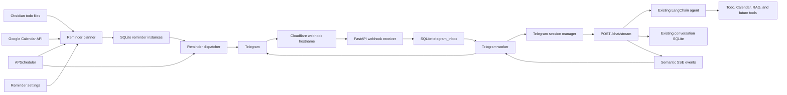

# Telegram Chat, HITL, and Reminder System - Implementation Specification

## 0. Document Status

This document specifies the planned Telegram integration for the Personal AI Assistant.

It covers:

- Telegram as a full chat channel for the existing AI agent.
- Telegram delivery through a webhook on the existing Cloudflare named tunnel.
- Conversation creation, one-hour inactivity rollover, listing, and selection.
- Human-in-the-loop (HITL) confirmation using single-use inline buttons.
- Safe semantic process traces in Telegram.
- Configurable daily todo and Calendar summaries.
- Thirty-minute reminders for timed todos and Calendar events.
- A 5 PM incomplete-todo summary.
- Temporary and indefinite reminder pauses.

This is an implementation specification, not an implementation. No behavior described here is considered complete until its acceptance criteria and tests pass.

---

## 1. Goals

### 1.1 Product goals

The system must allow the authorized user to:

1. Chat with the existing AI agent from Telegram.
2. Continue using the same tools, prompts, safety rules, and SQLite conversation history used by the browser.
3. Start a new conversation manually.
4. Automatically start a new conversation when the current Telegram conversation has been inactive for at least one hour.
5. List existing conversations and select one to continue.
6. Confirm or cancel sensitive actions using Telegram inline buttons.
7. See safe process traces without receiving raw model reasoning.
8. Receive a daily summary of today's todos and Calendar events at a user-selected time, defaulting to 09:00.
9. Receive a reminder 30 minutes before each timed todo and timed Calendar event.
10. Receive a list of incomplete todos at 17:00.
11. Pause all reminders for the rest of today, for seven days, or indefinitely.
12. Resume reminders manually.

### 1.2 Engineering goals

The implementation must:

- Preserve the current local-first architecture.
- Use the current FastAPI agent endpoint rather than create a second Telegram-specific agent.
- Keep Telegram transport logic separate from agent, todo, Calendar, and reminder domain logic.
- Persist inbound Telegram updates before acknowledging the webhook.
- Be idempotent under duplicate webhook delivery and repeated button presses.
- Keep raw Google Calendar IDs and secrets out of user-facing messages.
- Keep reminder decisions deterministic; the LLM must not be responsible for waking up at a scheduled time.
- Survive normal API, worker, and tunnel restarts without duplicating completed actions or notifications.

---

## 2. Non-Goals for the First Release

The first release will not:

- Support public or multi-tenant bot registration.
- Support group chats, supergroups, channels, or multiple authorized users.
- Expose raw chain-of-thought or provider reasoning data.
- Guarantee delivery while the local computer is powered off, asleep, disconnected, or unable to reach Telegram.
- Move the agent, conversation database, todo vault, or Google credentials to a cloud host.
- Use Telegram as a replacement for the browser UI.
- Implement voice, image, document, or location inputs.
- Synchronize a live streaming token-by-token response into Telegram.
- Use Telegram's job queue as the durable reminder source of truth.

---

## 3. Existing System Constraints

The implementation must fit the current verified architecture:

- FastAPI runs locally and exposes `/chat/stream`.
- The browser consumes semantic SSE events from `/chat/stream`.
- The browser frontend is hosted on Cloudflare Pages.
- The local backend is exposed through a Cloudflare named tunnel.
- The existing API hostname is protected by Cloudflare Access.
- The active agent uses LangChain `create_agent`.
- Conversation history is stored in SQLite through `src/db/conver_sqlite.py`.
- Agent events are appended to `data/event_logs/agent_events.jsonl`.
- Daily todos are stored as Obsidian Markdown files.
- Google Calendar access uses local OAuth credentials.
- Malaysia time uses the `Asia/Kuala_Lumpur` timezone.

The Telegram implementation must reuse these capabilities rather than introduce parallel conversation memory or duplicate tool logic.

---

## 4. Locked Architecture Decisions

### 4.1 Telegram is an API client

Telegram is another client of the same FastAPI agent API.

The Telegram worker will call:

```text
POST http://127.0.0.1:8000/chat/stream
```

It will pass the Telegram message and resolved `conversation_id`, consume the same SSE event contract as the browser, and translate those events into Telegram messages.

The Telegram integration must not create a separate agent instance with separate prompts, tool registration, or memory behavior.

### 4.2 Webhook instead of long polling

Telegram updates will be received through a webhook because the project already has a working named Cloudflare tunnel and the bot will support interactive chat and callbacks.

The preferred public route is:

```text
https://telegram.bojiakpui-xyz-student-web-app.me/webhook
```

The hostname will use the existing named tunnel and route to:

```text
http://localhost:8000
```

The main API hostname remains protected by Cloudflare Access.

The Telegram hostname or exact webhook path must be publicly reachable because Telegram cannot complete the interactive Cloudflare Access login. Only the webhook route is public; all other unknown routes on the Telegram hostname must return `404`.

### 4.3 SQLite inbox before HTTP 200

The webhook route must persist a valid Telegram update before returning success.

```text
Telegram POST
-> validate webhook secret
-> validate request structure and size
-> insert update by unique update_id
-> return HTTP 200
-> background worker processes the persisted update
```

The route must not wait for an LLM run before returning.

### 4.4 Separate transport and domain boundaries

The system has four distinct responsibilities:

1. **Webhook receiver** - authenticates and persists Telegram updates.
2. **Telegram worker** - consumes the inbox, manages Telegram UX, and calls the agent API.
3. **Reminder worker** - plans and dispatches scheduled notifications.
4. **FastAPI agent API** - owns agent execution and conversation events.

The Telegram and reminder workers may run in one operating-system process for the first release, but their modules and services must remain separate.

---

## 5. High-Level Architecture



---

## 6. Recommended Technology Stack

| Concern | Choice | Reason |
|---|---|---|
| Telegram SDK | `python-telegram-bot>=22.8,<23` | Async Telegram API, inline keyboards, callbacks, webhook helpers, and maintained Python support. |
| Scheduler | `APScheduler>=3.11.3,<4` | Stable 3.x release; 4.x remains pre-release. |
| Durable state | Python `sqlite3` | Matches the project's local-first storage direction and avoids an unnecessary ORM. |
| HTTP client | `httpx` explicitly declared | Async POST and SSE consumption from the local FastAPI API. |
| Validation | Pydantic v2 | Already used in the project for tool and API schemas. |
| Timezone | `ZoneInfo` with existing fallback | Reuses `Asia/Kuala_Lumpur` handling. |
| External ingress | Existing Cloudflare named tunnel | No public port or new hosting service is required. |
| Process startup | Windows Task Scheduler | Starts and restarts the Telegram/reminder worker locally. |

APScheduler will wake the planner and dispatcher. It will not be the durable store for reminder instances. The project's own SQLite tables will preserve reminder state.

---

## 7. Proposed Module Structure

```text
src/
  telegram/
    __init__.py
    auth.py
    client.py
    commands.py
    confirmations.py
    conversations.py
    inbox.py
    models.py
    traces.py
    webhook.py
    worker.py

  reminders/
    __init__.py
    db.py
    dispatcher.py
    models.py
    planner.py
    policy.py
    scheduler.py
    worker.py

  tools/
    todos.py

  services/
    calendar.py

  api/
    main.py
```

Responsibilities:

- `src/tools/todos.py`: canonical todo model, invisible identity calculation, Markdown parsing/serialization, vault mutations, and LangChain CRUD tools.
- `src/services/calendar.py`: structured Calendar reads and mutations with pagination.
- Reminder code imports the structured todo functions and models from `src/tools/todos.py`; it must not parse LangChain tool output strings.
- Calendar LangChain tools become thin wrappers around the planned structured Calendar service.
- `src/telegram/webhook.py` exposes the public receiver route.
- `src/telegram/worker.py` consumes persisted updates.
- `src/reminders/worker.py` owns scheduled planning and dispatch.

---

## 8. Todo Format Extension

### 8.1 New canonical format

Each todo needs an optional time. Reminder identity is an invisible deterministic source key and is not written into Obsidian:

```markdown
- [ ] Submit internship report
Time: 14:00
Note: Attach the final PDF
```

The daily filename supplies the date. `Time: -` represents no specific time.

```markdown
- [ ] Buy groceries
Time: -
Note: -
```

The source key is SHA-256 over the todo date, normalized item text, and duplicate ordinal in document order. Completion, time, and note are deliberately excluded.

### 8.2 Structured model

```python
class TodoItem(BaseModel):
    source_key: str
    duplicate_ordinal: int
    todo_date: date
    item_text: str
    note: str
    completed: bool
    due_time: time | None
```

### 8.3 Compatibility policy

- The parser must continue reading the current two-line format.
- Reading a legacy file must remain read-only.
- No one-time migration is required. A file is canonicalized only when an existing mutation already requires a write.
- Historical files remain unchanged unless the user or a tool edits them.
- Legacy UUID comments are accepted during parsing and removed during serialization.
- Source keys remain stable across check, uncheck, note, and time edits.
- Editing item text or moving the todo to another date changes its source key.
- Duplicate item text receives a distinct ordinal and source key in document order.
- List indices remain a user-facing selection mechanism but are not reminder identities.

### 8.4 Reminder semantics

- Only todos with `due_time` receive a pre-start reminder.
- Untimed todos remain visible in daily and incomplete summaries.
- Completing, deleting, or moving a todo cancels its pending reminder during reconciliation.
- Editing the time replaces the pending reminder with a new instance.

---

## 9. Calendar Service Refactor

The reminder planner must not parse the formatted string returned by `list_google_calendar_events`.

Create a typed Calendar service:

```python
class CalendarEvent(BaseModel):
    id: str
    title: str
    start_at: datetime | None
    end_at: datetime | None
    all_day_date: date | None
    timezone: str
    status: str
    location: str | None
```

Requirements:

- Fetch all events in the requested range using Google pagination.
- Do not retain the current agent-tool limit of ten events for reminder planning.
- Exclude cancelled events.
- Preserve Google event IDs internally but never display them to the user.
- Distinguish timed from all-day events.
- Reuse the same service for agent tools and reminder reads.
- Report OAuth or network failures explicitly.
- Never silently create a todo when Calendar access fails.

All-day events appear in the daily digest but do not receive a thirty-minute reminder.

---

## 10. SQLite Data Model

Use a new local database:

```text
data/telegram_reminders.sqlite3
```

It must remain local and Git-ignored.

Database requirements:

- Store timestamps as UTC ISO 8601 strings and convert to `Asia/Kuala_Lumpur` only at display and scheduling boundaries.
- Enable `PRAGMA foreign_keys = ON` for every connection.
- Use WAL mode and a bounded `busy_timeout` because the webhook receiver and workers may access the database concurrently.
- Apply explicit, versioned, idempotent migrations.
- Keep transactions short; never hold a write transaction while calling Telegram, Google, or the agent API.

### 10.1 `telegram_inbox`

Stores every accepted webhook update before processing.

```sql
CREATE TABLE telegram_inbox (
    update_id INTEGER PRIMARY KEY,
    update_type TEXT NOT NULL,
    payload_json TEXT NOT NULL,
    status TEXT NOT NULL CHECK (
        status IN ('pending', 'processing', 'completed', 'failed', 'ignored')
    ),
    attempt_count INTEGER NOT NULL DEFAULT 0,
    last_error TEXT,
    received_at TEXT NOT NULL,
    processing_started_at TEXT,
    processed_at TEXT
);
```

Invariants:

- `update_id` is the webhook idempotency key.
- Duplicate inserts return HTTP 200 without creating duplicate work.
- A crashed `processing` row can be reclaimed after a configured stale-processing interval.

Recommended index:

```sql
CREATE INDEX idx_telegram_inbox_status_received
ON telegram_inbox (status, received_at);
```

### 10.2 `telegram_sessions`

Maps the authorized Telegram chat to its current conversation.

```sql
CREATE TABLE telegram_sessions (
    telegram_chat_id INTEGER PRIMARY KEY,
    telegram_user_id INTEGER NOT NULL,
    active_conversation_id TEXT,
    last_user_activity_at TEXT,
    created_at TEXT NOT NULL,
    updated_at TEXT NOT NULL
);
```

Only incoming user messages or explicit conversation selections update `last_user_activity_at`. Reminders, traces, callback acknowledgements, and outgoing assistant messages do not.

### 10.3 `pending_confirmations`

Stores exact prepared actions awaiting user confirmation.

```sql
CREATE TABLE pending_confirmations (
    id TEXT PRIMARY KEY,
    telegram_chat_id INTEGER NOT NULL,
    telegram_user_id INTEGER NOT NULL,
    conversation_id TEXT NOT NULL,
    tool_name TEXT NOT NULL,
    tool_args_json TEXT NOT NULL,
    expected_state_json TEXT,
    action_fingerprint TEXT NOT NULL,
    prompt_message_id INTEGER,
    status TEXT NOT NULL CHECK (
        status IN ('pending', 'processing', 'confirmed', 'cancelled', 'invalid', 'failed')
    ),
    created_at TEXT NOT NULL,
    updated_at TEXT NOT NULL,
    resolved_at TEXT
);
```

There is no automatic expiry in the first release.

The action fingerprint prevents a confirmation from authorizing modified tool arguments.

### 10.4 `reminder_settings`

One row per authorized Telegram chat.

```sql
CREATE TABLE reminder_settings (
    telegram_chat_id INTEGER PRIMARY KEY,
    timezone TEXT NOT NULL DEFAULT 'Asia/Kuala_Lumpur',
    daily_digest_enabled INTEGER NOT NULL DEFAULT 1,
    daily_digest_time TEXT NOT NULL DEFAULT '09:00',
    pre_start_enabled INTEGER NOT NULL DEFAULT 1,
    lead_minutes INTEGER NOT NULL DEFAULT 30,
    incomplete_digest_enabled INTEGER NOT NULL DEFAULT 1,
    incomplete_digest_time TEXT NOT NULL DEFAULT '17:00',
    reminders_enabled INTEGER NOT NULL DEFAULT 1,
    paused_until TEXT,
    created_at TEXT NOT NULL,
    updated_at TEXT NOT NULL
);
```

### 10.5 `reminder_instances`

Acts as the durable reminder outbox.

```sql
CREATE TABLE reminder_instances (
    id TEXT PRIMARY KEY,
    dedupe_key TEXT NOT NULL UNIQUE,
    telegram_chat_id INTEGER NOT NULL,
    reminder_type TEXT NOT NULL CHECK (
        reminder_type IN ('daily_digest', 'pre_start', 'incomplete_digest')
    ),
    source_type TEXT NOT NULL CHECK (
        source_type IN ('todo', 'calendar', 'system')
    ),
    source_id TEXT,
    scheduled_for TEXT NOT NULL,
    status TEXT NOT NULL CHECK (
        status IN ('pending', 'processing', 'sent', 'suppressed', 'cancelled', 'failed')
    ),
    attempt_count INTEGER NOT NULL DEFAULT 0,
    telegram_message_id INTEGER,
    last_error TEXT,
    created_at TEXT NOT NULL,
    updated_at TEXT NOT NULL,
    sent_at TEXT
);
```

Recommended deduplication keys:

```text
daily:{chat_id}:{local_date}:{digest_time}
incomplete:{chat_id}:{local_date}:{digest_time}
todo:{todo_id}:{todo_date}:{due_time}:{lead_minutes}
calendar:{event_id}:{start_at}:{lead_minutes}
```

Recommended dispatcher index:

```sql
CREATE INDEX idx_reminder_instances_due
ON reminder_instances (status, scheduled_for);
```

### 10.6 `telegram_run_messages`

Maps an agent run to Telegram messages used for trace display.

```sql
CREATE TABLE telegram_run_messages (
    run_id TEXT PRIMARY KEY,
    conversation_id TEXT NOT NULL,
    telegram_chat_id INTEGER NOT NULL,
    status_message_id INTEGER,
    final_message_id INTEGER,
    created_at TEXT NOT NULL,
    updated_at TEXT NOT NULL
);
```

---

## 11. Webhook Contract

### 11.1 Endpoint

```text
POST /telegram/webhook
```

The route is available only through the Telegram webhook hostname and locally for tests.

### 11.2 Authentication

Configure Telegram `setWebhook` with a random secret token.

FastAPI must compare the incoming header using a constant-time comparison:

```text
X-Telegram-Bot-Api-Secret-Token
```

The bot token and webhook secret must be different values.

### 11.3 Validation

Before persistence:

- Require `Content-Type: application/json`.
- Enforce a conservative request-size limit.
- Validate the update with a Pydantic schema or the Telegram SDK model.
- Determine a supported update type.
- Reject invalid secrets with `401` or `403`.
- Reject malformed updates with `400`.

After valid persistence:

- Return `200` for a newly inserted update.
- Return `200` for a duplicate `update_id`.
- Do not run the agent inside the webhook request.

### 11.4 Supported update types

Initially request only:

```text
message
callback_query
```

Unsupported valid updates are stored as `ignored` or rejected through `allowed_updates` configuration.

---

## 12. Telegram Worker Workflow

The worker repeatedly claims one or more `pending` inbox rows.

Claiming must be transactional so only one worker processes an update:

```text
pending -> processing
```

Processing result:

```text
processing -> completed | ignored | failed
```

Retry policy:

- Retry temporary network failures and HTTP 5xx responses.
- Do not retry invalid user commands or authorization failures.
- Cap attempts, initially at three.
- Preserve `last_error` for inspection.
- Reclaim rows stuck in `processing` after a configured interval.

Only one Telegram worker may run in the first release.

---

## 13. Authorized User Policy

Required local configuration:

```text
TELEGRAM_BOT_TOKEN
TELEGRAM_WEBHOOK_SECRET
TELEGRAM_ALLOWED_USER_ID
TELEGRAM_ALLOWED_CHAT_ID
TELEGRAM_WEBHOOK_URL
```

For every message and callback:

1. Verify the Telegram user ID.
2. Verify the Telegram chat ID.
3. Require a private chat.
4. Ignore or reject all other users and chats.

The webhook secret authenticates Telegram as the HTTP sender. The user and chat checks authorize the person using the bot. They are separate checks.

---

## 14. Conversation Session Policy

### 14.1 Default behavior

For each ordinary Telegram user message:

```text
if no active conversation:
    create a new conversation
elif last user activity was at least 60 minutes ago:
    create a new conversation
else:
    continue the active conversation
```

When automatic rollover occurs, Telegram should briefly state:

```text
Started a new conversation after 1 hour of inactivity.
```

The timeout uses Malaysia time for display but must compare timezone-aware instants.

### 14.2 Manual conversation commands

| Command | Behavior |
|---|---|
| `/new` | Create and select a new conversation immediately. |
| `/current` | Show the active conversation title and last user activity. |
| `/conversations` | List recent conversations with inline selection buttons. |

### 14.3 Conversation selection

`/conversations` displays five conversations per page:

```text
Choose a conversation:

[Today's planning]
[Finance database design]
[Internship application]

[Previous] [Next]
[+ New conversation]
```

Each selection callback carries a short opaque reference or conversation ID that fits Telegram's callback-data limit.

On selection:

- Verify the conversation exists.
- Set it as `active_conversation_id`.
- Set `last_user_activity_at` to the selection time.
- Remove the selection keyboard or replace it with a non-clickable selected state.
- Tell the user which conversation is now active.

Selecting an old conversation overrides the one-hour automatic rollover for the next message.

### 14.4 Concurrency

Only one agent run may be active per conversation.

If a second message arrives while a run is active, queue it behind the current run and preserve arrival order.

Do not run two agent turns concurrently against the same conversation history.

---

## 15. Agent API Integration

### 15.1 Chat endpoint

Telegram uses the existing endpoint:

```http
POST /chat/stream
Content-Type: application/json

{
  "message": "What is on my schedule today?",
  "conversation_id": "existing-id-or-null"
}
```

Rules:

- Pass `null` to create a conversation.
- Store the `conversation_id` returned by the `conversation_ready` SSE event.
- Pass the active ID for continuation.
- Consume all events until `final` or `error`.
- Update `last_user_activity_at` when the incoming user message is accepted.
- Do not update it when the assistant finishes.

### 15.2 Local connectivity

The Telegram worker must call the loopback API URL, not the public Access-protected hostname.

Default:

```text
TELEGRAM_AGENT_API_BASE_URL=http://127.0.0.1:8000
```

If the worker is moved off-machine later, add explicit service authentication before using the public hostname.

### 15.3 API consistency

The non-streaming `/chat` endpoint currently does not provide the same persisted conversation flow. Telegram will use `/chat/stream` until both endpoints share the same conversation application service.

### 15.4 Confirmation resolution endpoint

Button decisions use a structured local FastAPI endpoint rather than sending synthetic text such as `I confirm` back through the LLM:

```http
POST /confirmations/{confirmation_id}/resolve
Content-Type: application/json

{
  "decision": "confirm",
  "channel": "telegram",
  "telegram_update_id": 123456789
}
```

The endpoint:

- Loads the persisted callback update and authorized Telegram identity.
- Atomically claims or cancels the pending confirmation.
- Executes only the exact prepared, allowlisted action when confirmed.
- Revalidates the current todo or Calendar state.
- Stores the confirmation decision, tool result, and resulting assistant status in conversation history.
- Returns a structured result for the Telegram worker to render.

This remains the same FastAPI application boundary while avoiding an ambiguous second LLM turn for button presses.

---

## 16. Telegram Trace UX

### 16.1 Trace source

Telegram traces use the existing app-owned semantic events from `/chat/stream`.

Allowed trace content:

- Conversation ready.
- Agent run started.
- Tool requested.
- Safe tool name and arguments.
- Tool result received.
- Safe result preview.
- Run failed or completed.

Forbidden trace content:

- Raw chain-of-thought.
- Provider reasoning blocks.
- OAuth tokens, bot tokens, secrets, or credentials.
- Raw Calendar IDs in user-visible text.
- Full sensitive tool results when a safe preview is sufficient.

### 16.2 Live trace message

Send one status message per run and edit it only when the semantic stage changes:

```text
Process

[done] Loaded conversation
[done] Listed today's todos
[working] Checking Calendar
```

Do not send one Telegram message for every SSE event.

### 16.3 Completion

After the final response:

- Edit the process message to `Process completed` or `Process failed`.
- Send the final answer as a separate message.
- Add a `View process` button when stored trace details are available.

The `View process` callback displays a compact trace derived from stored conversation and agent events.

Long messages must be split on paragraph boundaries within Telegram's message-size limit.

---

## 17. HITL Confirmation Design

### 17.1 Actions requiring confirmation

The existing safety policy remains authoritative. Examples include:

- All Google Calendar deletions.
- Calendar create/update batches that cross the configured confirmation threshold.
- Todo duplicates when the agent requires explicit user confirmation.
- Future destructive or high-volume external writes.

### 17.2 Confirmation request

An application-owned confirmation policy evaluates proposed external mutations before execution. When confirmation is required, it must:

1. Validate and normalize the proposed tool arguments.
2. Capture the current expected source state.
3. Create a `pending_confirmations` row containing the exact tool name and arguments.
4. Compute an action fingerprint over the normalized action.
5. Emit a structured `confirmation_required` semantic event.
6. Stop the proposed action before any external mutation occurs.

The Telegram worker renders that structured event as buttons. It must not parse an ordinary assistant sentence to discover whether confirmation is required.

Telegram displays:

```text
Delete "Doctor appointment"?

[Confirm] [Cancel]
```

Button callback data contains only a short action and confirmation ID:

```text
confirm:8f31a2
cancel:8f31a2
```

Do not place raw tool arguments or Calendar event IDs in callback data.

### 17.3 Confirm workflow

```text
1. Validate webhook secret at ingress.
2. Validate allowed Telegram user and chat.
3. Call the local structured confirmation-resolution endpoint.
4. Atomically change confirmation from pending to processing in that endpoint.
5. Call `answerCallbackQuery`.
6. Remove the inline keyboard.
7. Edit the message to show Processing.
8. Validate the current source state.
9. Execute only the exact stored action.
10. Store tool result and conversation event.
11. Edit the Telegram message with success or failure.
12. Mark confirmation confirmed, invalid, or failed.
```

The button becomes non-clickable immediately after the confirmation is successfully claimed.

### 17.4 Cancel workflow

```text
1. Validate user and chat.
2. Call the local structured confirmation-resolution endpoint with `decision=cancel`.
3. Atomically change pending to cancelled.
4. Answer callback query.
5. Remove buttons.
6. Edit message to show Cancelled.
7. Store a confirmation-decision conversation event.
```

### 17.5 No expiration policy

Pending confirmations do not automatically expire in the first release.

An old confirmation can still become `invalid` when source validation fails, for example:

- The Calendar event was already deleted.
- The title no longer matches the expected title.
- The todo was completed, deleted, or materially changed.
- The exact stored action is no longer permitted.

### 17.6 Idempotency

Only a `pending` confirmation may transition to `processing` or `cancelled`.

Repeated callbacks after the first successful claim must:

- Call `answerCallbackQuery` with a short `Already handled` message.
- Perform no external mutation.
- Leave the Telegram keyboard removed.

---

## 18. Reminder Features

### 18.1 Daily digest

At the configured local time, default 09:00, send:

- All todos for today, grouped into incomplete and completed when useful.
- All Calendar events for today in chronological order.
- All-day events in a separate section.
- Timed todo due times.

The user can change the time without restarting the worker.

### 18.2 Pre-start reminders

Default lead time: 30 minutes.

Eligible sources:

- Incomplete timed todos.
- Non-cancelled timed Calendar events.

Ineligible sources:

- Untimed todos.
- Completed todos.
- Deleted todos.
- All-day Calendar events.
- Cancelled events.
- Events or todos whose start/due time has already passed.

### 18.3 Incomplete-todo digest

At 17:00 local time, send all unchecked todos for today.

If none remain:

```text
All of today's todos are complete.
```

### 18.4 Pause behavior

| User choice | Stored state |
|---|---|
| Pause today | `paused_until` is next local midnight. |
| Pause seven days | `paused_until` is current instant plus seven days. |
| Pause indefinitely | `reminders_enabled = 0`. |
| Resume | Clear `paused_until` and set `reminders_enabled = 1`. |

Every dispatch rechecks the pause policy.

Reminders that become due during a pause are marked `suppressed`. They must not be sent in a burst after resuming.

### 18.5 Reminder controls

Commands:

| Command | Behavior |
|---|---|
| `/today` | Send today's digest immediately. |
| `/set_daily HH:MM` | Change daily digest time. |
| `/set_lead MINUTES` | Change pre-start lead time. |
| `/pause today` | Pause through local midnight. |
| `/pause week` | Pause for seven days. |
| `/pause forever` | Disable reminders until resumed. |
| `/resume` | Resume all reminder types. |
| `/reminder_status` | Show settings and pause state. |

Reminder messages may also include inline buttons for the common pause choices.

---

## 19. Reminder Planning and Dispatch

### 19.1 APScheduler jobs

The worker registers stable recurring jobs:

```text
reconcile_reminders: every 5 minutes
dispatch_due_reminders: every 1 minute
cleanup_old_records: daily
```

Use stable job IDs with replacement on startup so restarts do not create duplicate scheduler jobs.

### 19.2 Reconciliation

The planner:

1. Reads reminder settings.
2. Loads today's todos through the structured todo service.
3. Loads today's Calendar events through the structured Calendar service.
4. Computes desired reminder instances.
5. Inserts missing instances using `dedupe_key`.
6. Cancels pending instances that no longer match their source.
7. Replaces reminders whose time or lead time changed.

Todo and Calendar agent mutations should request an immediate reconciliation after they succeed. The five-minute job remains a safety net for direct Obsidian or Google Calendar edits made outside the agent.

### 19.3 Dispatch

For each due reminder:

1. Atomically claim `pending -> processing`.
2. Re-read reminder settings.
3. Apply global pause policy.
4. Re-read the current todo or Calendar event.
5. Skip stale, completed, cancelled, or deleted sources.
6. Render a deterministic message.
7. Send through Telegram.
8. Store Telegram message ID and mark `sent`.

Do not use the LLM to render ordinary reminder messages.

### 19.4 Newly added near-term items

If a timed item is created with less than the configured lead time remaining:

- Send one immediate reminder if the item is still in the future.
- Do not send a fake pre-start reminder if the due/start time has passed.

### 19.5 Catch-up after downtime

Recommended first-release policy:

- Pre-start reminder: send immediately only when the item is still in the future; otherwise suppress.
- Daily digest: send after restart only when less than 60 minutes late.
- Incomplete digest: send after restart only when less than 120 minutes late.
- Never send reminders that were due during an explicit pause.

---

## 20. Telegram Commands and Routing Priority

Deterministic commands must bypass the LLM:

```text
/start
/help
/new
/current
/conversations
/today
/set_daily
/set_lead
/pause
/resume
/reminder_status
/pending
```

All other authorized text messages are sent to `/chat/stream`.

Routing priority:

```text
callback query
-> deterministic slash command
-> ordinary agent chat message
```

Malformed deterministic commands return usage instructions and are not sent to the agent.

---

## 21. Telegram Message UX

### 21.1 Agent run

```text
User message
-> Telegram typing indicator
-> one editable process message
-> final answer message
```

### 21.2 Reminder example

```text
Reminder: Submit internship report in 30 minutes

Due: 14:00
Note: Attach the final PDF
```

Possible buttons:

```text
[Mark done] [Pause today]
```

`Mark done` is treated as an external mutation and must use the current invisible todo source key plus current-state validation. Because the source key is derived rather than stored, the handler must re-read the source file before applying the mutation.

### 21.3 Daily digest example

```text
Today - Thursday, 16 July

Todos
[ ] 10:00 Submit application
[ ] Buy groceries
[x] Review notes

Calendar
09:00 Team meeting
14:30 Dentist
All day: Internship deadline
```

---

## 22. Security Requirements

### 22.1 Secrets

The following remain local and must never be committed:

```text
TELEGRAM_BOT_TOKEN
TELEGRAM_WEBHOOK_SECRET
TELEGRAM_ALLOWED_USER_ID
TELEGRAM_ALLOWED_CHAT_ID
Google OAuth client secret
Google Calendar token
```

### 22.2 Webhook exposure

- Expose only the webhook path on the Telegram hostname.
- Keep the main API hostname protected by Cloudflare Access.
- Use HTTPS through Cloudflare.
- Validate the Telegram secret header.
- Optionally add Cloudflare rate limiting.
- Do not use a broad Access Bypass on the main API application.

### 22.3 Application authorization

- Require exact user and chat allowlist matches.
- Reject groups for the first release.
- Treat all callback data as untrusted input.
- Resolve callback references from SQLite.
- Never execute serialized arbitrary Python callables from SQLite.
- Use an explicit allowlist of confirmable tools/actions.

### 22.4 Data handling

- Store raw webhook payloads locally.
- Do not include secrets in logs.
- Redact sensitive tool arguments from Telegram traces.
- Preserve the existing rule that Calendar IDs are internal only.

---

## 23. Reliability and Failure Handling

### 23.1 Duplicate webhook updates

Handled by primary key `telegram_inbox.update_id`.

### 23.2 Duplicate callback presses

Handled by atomic confirmation status transition.

### 23.3 Telegram send failure

- Retry temporary failures up to the configured maximum.
- Respect Telegram retry information when supplied.
- Persist the error and attempt count.
- Do not rerun an already completed external tool mutation merely because the success message failed to send.

### 23.4 Agent failure

- Persist the existing run error event.
- Mark the inbox update failed or completed-with-error according to the final contract.
- Edit the Telegram process message to show failure.
- Do not silently retry a tool-using agent turn unless idempotency is proven.

### 23.5 Google Calendar failure

- Continue todo-only reminder behavior.
- Report Calendar unavailability in the daily digest or logs as appropriate.
- Never create fallback todos without the user asking.

### 23.6 Local computer offline or asleep

Exact delivery is not guaranteed. Apply the catch-up policy on restart.

If always-on delivery becomes a hard requirement, move only the Telegram/reminder gateway and its minimum state to an always-on host after a separate deployment decision.

---

## 24. Observability

### 24.1 Local logs

Log structured events for:

- Webhook accepted, duplicate, rejected, or malformed.
- Inbox claim, completion, retry, and terminal failure.
- Conversation creation, rollover, and selection.
- Agent API start, final, and error.
- Telegram send/edit failure.
- Confirmation created, claimed, confirmed, cancelled, invalid, or failed.
- Reminder planned, replaced, cancelled, suppressed, sent, or failed.
- Calendar reconciliation failure.

### 24.2 Existing semantic events

Continue appending agent events to:

```text
data/event_logs/agent_events.jsonl
```

Telegram must consume the same safe event contract rather than invent a second trace taxonomy.

### 24.3 Health information

Extend health/status reporting with:

- Telegram webhook configured status.
- Last accepted Telegram update time.
- Pending and failed inbox counts.
- Reminder worker running state.
- Next scheduler wake times.
- Last successful Calendar reconciliation.

Do not expose secrets or chat IDs in public health output.

---

## 25. Cloudflare and Deployment Workflow

### 25.1 Tunnel route

Add a public hostname to the existing named tunnel:

```text
telegram.bojiakpui-xyz-student-web-app.me -> http://localhost:8000
```

### 25.2 Access policy

Preferred configuration:

- Keep `api.bojiakpui-xyz-student-web-app.me` protected by Access.
- Configure the Telegram hostname specifically for the webhook receiver.
- Do not expose `/chat/stream` through the Telegram hostname.
- If an Access Bypass is required, scope it only to `/webhook`.

### 25.3 Webhook registration

Register:

```text
url=https://telegram.bojiakpui-xyz-student-web-app.me/webhook
secret_token=<TELEGRAM_WEBHOOK_SECRET>
allowed_updates=["message", "callback_query"]
drop_pending_updates=false
```

Verify with Telegram's webhook-info method after registration.

### 25.4 Local process startup

Required local processes:

1. FastAPI backend.
2. Cloudflare tunnel.
3. Telegram/reminder worker.

Use Windows Task Scheduler or an equivalent supervisor to start them on boot/login and restart them after failure.

---

## 26. Testing Strategy

### 26.1 Unit tests

Todo tests:

- Parse current legacy format.
- Parse canonical timed and untimed formats.
- Preserve source keys across completion, note, and time edits.
- Change the source key when item text changes.
- Give duplicate text distinct source keys.
- Reject malformed times.
- Confirm serialization never exposes source keys or legacy UUID comments.

Session tests:

- Create when no session exists.
- Reuse before one hour.
- Roll over at one hour.
- Manual `/new` override.
- Select an older conversation.
- Reminders do not refresh user activity.

Confirmation tests:

- Only pending rows can be claimed.
- Double click executes once.
- Cancel removes authorization.
- Wrong user/chat is rejected.
- Stale todo or Calendar state becomes invalid.
- Stored action fingerprint must match.

Reminder tests:

- Daily digest time calculation.
- Thirty-minute reminder calculation.
- All-day event exclusion.
- Completed todo suppression.
- Time edit replacement.
- Pause today, week, forever, and resume.
- No catch-up burst after pause.
- Downtime catch-up boundaries.

### 26.2 Integration tests

- Webhook secret accepted/rejected.
- Duplicate `update_id` returns 200 and stores once.
- Inbox worker posts to a fake `/chat/stream` SSE server.
- SSE events update one Telegram status message.
- Conversation ID from `conversation_ready` is stored.
- Confirmation buttons are removed after claim.
- Telegram failures do not duplicate external mutations.
- Calendar pagination returns more than ten events.

### 26.3 End-to-end tests

Using a development Telegram bot and private chat:

1. Send a chat message and receive the agent response.
2. Continue within one hour and verify shared history.
3. Force an inactivity rollover using an injected clock.
4. List conversations and select an older one.
5. Trigger Calendar deletion confirmation, confirm once, and verify the button disappears.
6. Trigger another confirmation and cancel it.
7. View a safe process trace.
8. Add a timed todo and receive its reminder.
9. Complete a todo before its reminder and verify suppression.
10. Pause reminders and verify due notifications are suppressed.
11. Change the daily digest time and verify rescheduling.

---

## 27. Build Order

### Phase 1 - Todo foundation and Calendar extraction

Completed todo foundation:

1. Centralize structured todo functions and LangChain CRUD tools in `src/tools/todos.py`.
2. Add the canonical optional-time format and invisible deterministic source keys.
3. Add backward-compatible parser and identity tests.
4. Keep existing agent-facing todo tool names stable.

Remaining work:

5. Add temporary-vault CRUD integration tests.
6. Extract structured Calendar service functions.
7. Add Calendar pagination and typed events.
8. Keep Calendar LangChain tools as thin wrappers around the service.

### Phase 2 - Telegram persistence and webhook

1. Create `telegram_reminders.sqlite3` and migrations.
2. Implement webhook-secret validation.
3. Persist and deduplicate Telegram updates.
4. Add inbox worker state transitions and retry policy.
5. Configure the dedicated tunnel hostname.
6. Register and verify the Telegram webhook.

### Phase 3 - Telegram chat and sessions

1. Implement authorized user/chat checks.
2. Implement Telegram session mapping.
3. Post messages to `/chat/stream` over loopback.
4. Persist the returned conversation ID.
5. Implement one-hour automatic rollover.
6. Add `/new`, `/current`, and `/conversations`.
7. Add conversation-selection buttons and pagination.

### Phase 4 - Telegram traces

1. Map existing safe SSE events to Telegram stages.
2. Add one editable process message per run.
3. Add final success/failure status.
4. Add `View process` using stored semantic events.
5. Verify that no raw reasoning or secrets are exposed.

### Phase 5 - Structured HITL

1. Add pending-confirmation persistence.
2. Define an explicit allowlist of confirmable actions.
3. Add confirmation and cancellation buttons.
4. Add atomic single-use claiming.
5. Remove buttons immediately after a valid choice.
6. Add source-state validation and exact-action execution.
7. Store confirmation decisions in conversation history.

### Phase 6 - Reminder engine

1. Add reminder settings and instance tables.
2. Implement deterministic planning and deduplication.
3. Implement dispatcher and Telegram notifier.
4. Add daily, pre-start, and incomplete summaries.
5. Add pause/resume behavior.
6. Trigger immediate reconciliation after agent mutations.
7. Register stable APScheduler jobs.

### Phase 7 - Reliability and startup

1. Add structured logging and health metrics.
2. Test retries, crashes, duplicates, and stale processing recovery.
3. Add Windows Task Scheduler startup/restart configuration.
4. Run development-bot end-to-end tests.
5. Perform a limited personal production rollout.

---

## 28. Acceptance Criteria

The feature is complete only when all of the following are true:

### Telegram connectivity

- Telegram webhook updates reach the local FastAPI service through the named tunnel.
- Invalid webhook secrets are rejected.
- Duplicate Telegram updates are processed at most once.
- The webhook returns promptly without waiting for the LLM.

### Chat and conversations

- Telegram ordinary text uses the same `/chat/stream` agent API as the browser.
- The same SQLite conversation history is used.
- Conversation continuation works within one hour.
- A new conversation is created after one hour of user inactivity.
- `/new` works immediately.
- `/conversations` lists and selects existing conversations.
- Two simultaneous messages do not run concurrently in the same conversation.

### Traces

- Telegram shows safe semantic progress.
- Only one status message is edited during a normal run.
- Final responses are delivered separately.
- `View process` displays stored safe trace data.
- No raw reasoning, secrets, or Calendar IDs are exposed.

### HITL

- Confirm and Cancel buttons work.
- Buttons are removed after the first valid choice.
- Repeated clicks do not repeat an action.
- No automatic confirmation expiry exists.
- Wrong users or chats cannot authorize actions.
- Stale source state blocks unsafe execution.

### Reminders

- The user can set the daily digest time.
- Today's todo and Calendar summary is sent at that time.
- Timed incomplete todos and timed events receive the configured lead reminder.
- All-day events do not receive pre-start reminders.
- The 17:00 message contains current incomplete todos.
- Pause today, pause week, pause forever, and resume all work.
- Reminders suppressed during pauses are not sent later in a burst.
- Restarts do not duplicate sent reminders.

### Operations

- Local database and secrets are ignored by Git.
- FastAPI, tunnel, and worker restart cleanly.
- Failures are observable without leaking secrets.
- Existing browser chat behavior remains functional.

---

## 29. Deferred Enhancements

After the first release is stable, consider:

- Voice messages transcribed and sent to the agent.
- Image/document inputs for finance and RAG workflows.
- Telegram message-level cancellation of a running agent turn.
- Multiple authorized users with isolated data and settings.
- Group-chat support with per-user authorization.
- A browser UI for reminder settings and pending confirmations.
- Cloud-hosted reminder gateway for delivery while the local computer is off.
- Google Calendar push notifications instead of periodic reconciliation.
- Natural-language reminder-setting commands interpreted by the agent, backed by deterministic settings tools.
- Richer Telegram response streaming when the chosen SDK fully supports the required Bot API version.

---

## 30. Official References

- Telegram Bot API: <https://core.telegram.org/bots/api>
- Telegram webhooks: <https://core.telegram.org/bots/api#setwebhook>
- Telegram callback queries: <https://core.telegram.org/bots/api#callbackquery>
- Telegram inline keyboard buttons: <https://core.telegram.org/bots/api#inlinekeyboardbutton>
- Telegram reply-markup editing: <https://core.telegram.org/bots/api#editmessagereplymarkup>
- Cloudflare Access application paths: <https://developers.cloudflare.com/cloudflare-one/access-controls/policies/app-paths/>
- Cloudflare public endpoint policies: <https://developers.cloudflare.com/cloudflare-one/access-controls/policies/common-policies/>
- APScheduler documentation: <https://apscheduler.readthedocs.io/en/3.x/>
- python-telegram-bot documentation: <https://docs.python-telegram-bot.org/>
